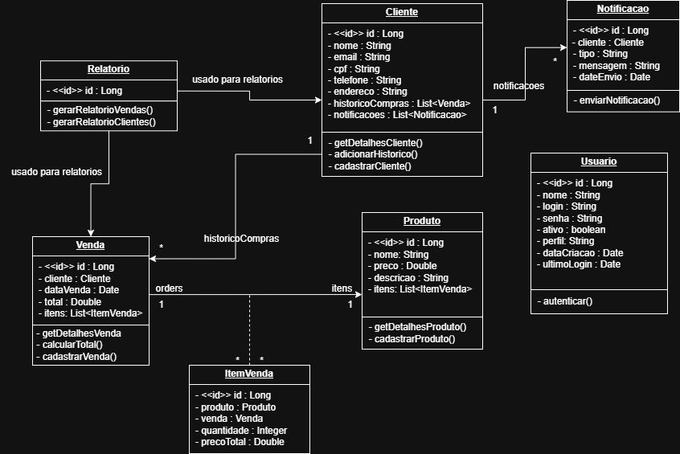

# 🛒 Sistema de Vendas

Este é um sistema de gerenciamento de vendas desenvolvido em **Java** com **Spring Boot**, utilizando **Spring Data JPA** para persistência, banco de dados **MySQL** via **Docker**, documentação com **Swagger**, arquitetura **MVC**, e uso de **Lombok** para redução de código repetitivo.

## 📌 Funcionalidades

- Cadastro e gerenciamento de clientes
- Registro de vendas com múltiplos produtos
- Cálculo automático do total da venda
- Histórico de compras por cliente
- Emissão de relatórios de vendas e clientes
- Notificações para os clientes
- Autenticação de usuários do sistema

## 🛠️ Tecnologias Utilizadas

| Tecnologia        | Finalidade                                  |
|-------------------|---------------------------------------------|
| Java 17+          | Linguagem principal                         |
| Spring Boot       | Framework principal para desenvolvimento    |
| Spring Data JPA   | ORM para acesso ao banco de dados           |
| MySQL             | Banco de dados relacional                   |
| Docker            | Containerização do banco de dados           |
| Lombok            | Redução de boilerplate no código Java       |
| Swagger (OpenAPI) | Documentação interativa dos endpoints       |

## 🧱 Arquitetura

O projeto segue a arquitetura MVC com separação por pacotes:

- model — Classes que representam as entidades do domínio (Cliente, Produto, Venda, Notificação, etc).
- repository — Interfaces para acesso e manipulação dos dados no banco.
- service — Lógica de negócio do sistema, onde ficam as regras e operações principais.
- controller — Endpoints REST para comunicação com clientes via HTTP.
- config — Configurações da aplicação (ex: Swagger, banco, etc).

## 🗃️ Modelagem (UML)
#### Diagrama do Projeto



## 🐳 Docker

### Subindo o banco de dados

```bash
docker run --name mysql-vendas -e MYSQL_ROOT_PASSWORD=root -e MYSQL_DATABASE=sistemavendas -p 3306:3306 -d mysql:8.0
```

### Acesso via terminal:

```bash
docker exec -it mysql-vendas bash
mysql -u root -p
```

## 🚀 Executando o Projeto:

### ⚙️ Requisitos

-   Java 17 ou superior
-   Maven
-   Docker
 
### 📋 Etapas  
1. Clone este repositorio:

 ```bash
git clone https://github.com/ruantor4/sistema-vendas.git
```

2.   Suba o banco de dados MySQL via Docker
    
3.   Configure o `application.properties` ou `application.yml`

```bash
# Database config MySQL

spring.jpa.hibernate.ddl-auto=update
spring.datasource.url=jdbc:mysql://localhost:3306/sistemavendas
spring.datasource.username=root
spring.datasource.password=root
spring.datasource.driver-class-name=com.mysql.cj.jdbc.Driver
spring.jpa.database-platform=org.hibernate.dialect.MySQL8Dialect
spring.jpa.show-sql: true
```
    
4.   Execute a aplicação com:


 ```bash
./mvnw spring-boot:run
```

## 🔍 Swagger
Após rodar o projeto, acesse a documentação interativa da API:
 
 ```bash
http://localhost:8080/swagger-ui/index.html
```

## 🗨️ Contato

Para Dúvidas ou sugestões, entre em contato: 

ruan.tor4@hotmail.com
